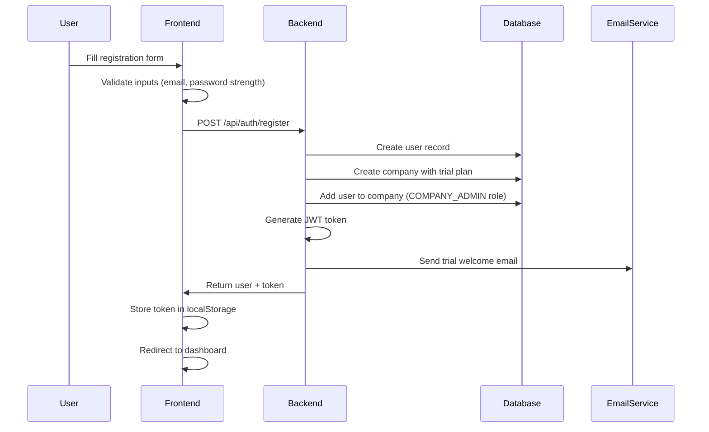
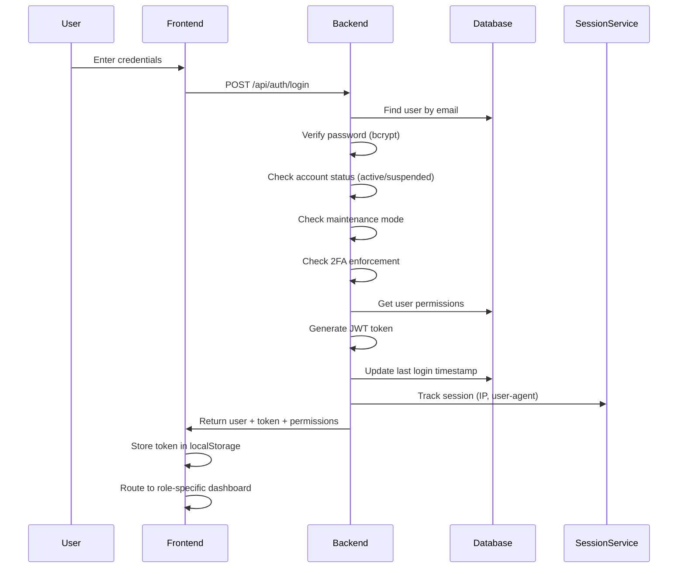
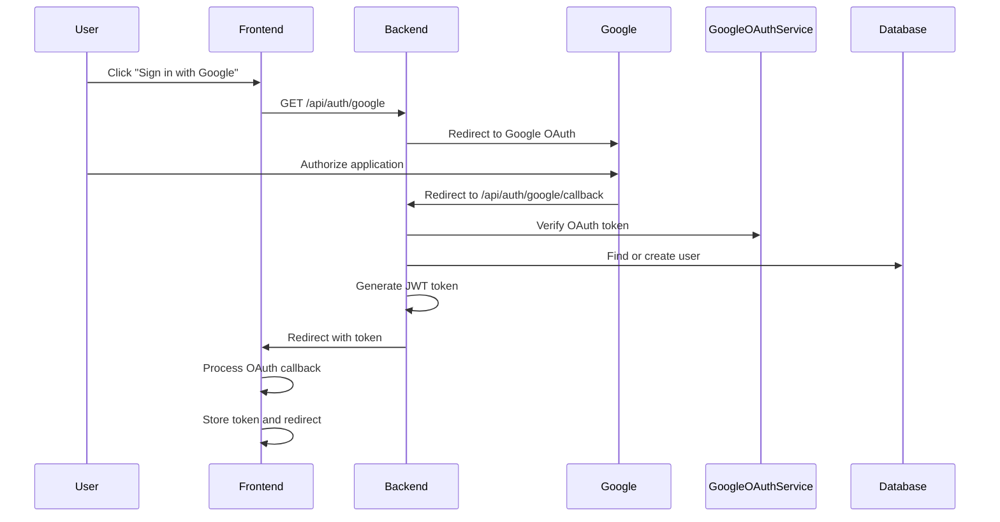
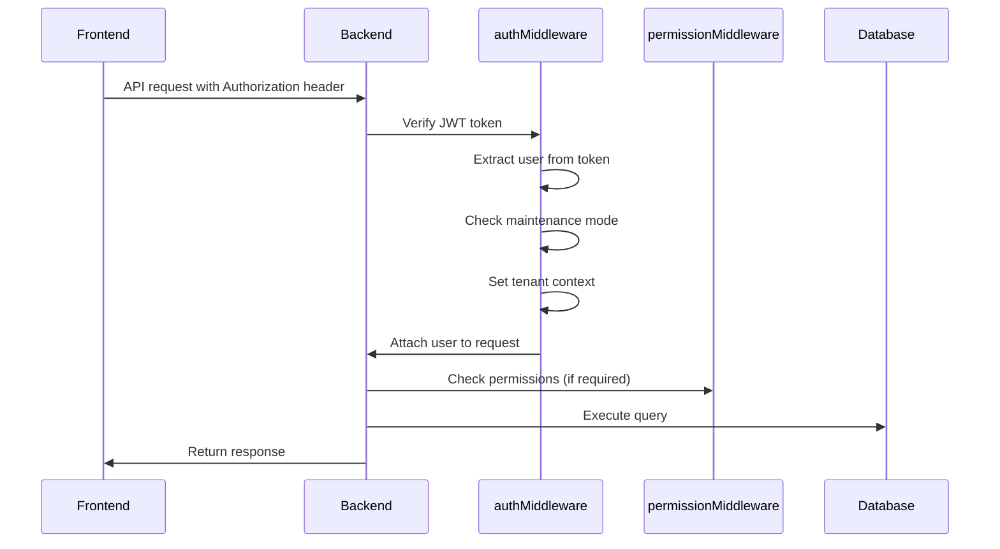

# Authentication & Registration Flow Documentation

## Overview

CortexBuild Pro implements a comprehensive multi-tenant authentication system with support for:
- Traditional email/password authentication
- Google OAuth 2.0 integration
- JWT-based session management
- Role-based access control (RBAC)
- Trial system with automated onboarding
- Email verification and notifications

## Architecture

### Backend Components

**Location**: `/server`

1. **Auth Routes** (`routes/authRoutes.ts`)
   - `POST /api/auth/login` - Email/password login
   - `POST /api/auth/register` - User registration with company creation
   - `GET /api/auth/roles` - List available roles
   - `GET /api/auth/me/context` - Get current user context

2. **OAuth Routes** (`routes/oauthRoutes.ts`)
   - `GET /api/auth/google` - Initiate Google OAuth flow
   - `GET /api/auth/google/callback` - OAuth callback handler
   - `POST /api/auth/google/link` - Link Google account to existing user
   - `DELETE /api/auth/google/unlink` - Unlink Google account
   - `GET /api/auth/oauth/providers` - Get linked OAuth providers
   - `POST /api/auth/oauth/refresh` - Refresh OAuth access token

3. **Controllers**
   - `controllers/authController.ts` - Authentication logic
   - Services:
     - `services/authService.ts` - Core auth service
     - `services/googleOAuthService.ts` - Google OAuth integration
     - `services/sessionService.ts` - Session tracking
     - `services/emailService.ts` - SendGrid email integration

4. **Middleware**
   - `middleware/authMiddleware.ts` - JWT verification and context
   - `middleware/permissionMiddleware.ts` - Permission-based route protection
   - `middleware/tenantMiddleware.ts` - Multi-tenant isolation

### Frontend Components

**Location**: `/src`

1. **Auth Context** (`contexts/AuthContext.tsx`)
   - Centralized authentication state management
   - Login/signup methods
   - Permission checking
   - Token management
   - OAuth integration

2. **Views**
   - `views/LoginView.tsx` - Login page
   - `views/RegisterView.tsx` - Registration page  
   - `views/AuthCallbackView.tsx` - OAuth callback handler

3. **Components**
   - `components/PasswordStrengthIndicator.tsx` - Password validation UI
   - `components/PhoneInput.tsx` - Phone number input

## Authentication Flows

### 1. Standard Registration Flow



**Registration Data**:
```typescript
{
  email: string;
  password: string;  // Min 8 chars, uppercase, lowercase, number, special char
  name: string;
  companyName: string;
}
```

**Trial System**:
- 14-day free trial automatically created
- 5GB storage quota
- 5GB database quota
- Max 10 users during trial
- Trial welcome email sent via SendGrid

### 2. Standard Login Flow



**Role-Based Routing**:
- `SUPERADMIN` → Platform Dashboard
- `COMPANY_ADMIN` → Company Dashboard
- `PROJECT_MANAGER` → Projects View
- `SUPERVISOR/OPERATIVE` → Projects View
- `READ_ONLY` → Client Portal

### 3. Google OAuth Flow



**OAuth Configuration** (`.env`):
```bash
GOOGLE_CLIENT_ID=your-google-client-id.apps.googleusercontent.com
GOOGLE_CLIENT_SECRET=your-google-client-secret
GOOGLE_CALLBACK_URL=https://api.cortexbuildpro.com/api/auth/google/callback
```

### 4. Token Validation Flow



## Security Features

### 1. Password Requirements
- Minimum 8 characters
- At least one uppercase letter
- At least one lowercase letter
- At least one number
- At least one special character

### 2. JWT Token Security
- Tokens signed with `JWT_SECRET` from environment
- Default expiration: 24 hours
- Tokens include: userId, email, role, companyId
- Tokens verified on every protected endpoint

### 3. Session Tracking
- IP address tracking
- User-agent tracking
- Last login timestamps
- Impersonation audit trail

### 4. Rate Limiting
- Client-side: 30-second delay between login attempts
- Server-side: Express rate limiter (configured per route)

### 5. Account Protection
- Account suspension checks
- Maintenance mode enforcement
- Optional 2FA enforcement
- Password reset with secure tokens

### 6. Multi-Tenant Isolation
- Row-level security through companyId
- Tenant context enforced on every request
- Header-based tenant switching for superadmins
- Foreign key constraints in database

## Database Schema

### Users Table
```sql
CREATE TABLE users (
  id VARCHAR(255) PRIMARY KEY,
  email VARCHAR(255) UNIQUE NOT NULL,
  password TEXT NOT NULL,
  name TEXT NOT NULL,
  role VARCHAR(50) NOT NULL,
  status VARCHAR(50) DEFAULT 'active',
  companyId VARCHAR(255),
  isActive BOOLEAN DEFAULT TRUE,
  resetTokenHash TEXT,
  resetExpiresAt TEXT,
  two_factor_enabled BOOLEAN DEFAULT FALSE,
  two_factor_secret TEXT,
  createdAt TEXT NOT NULL,
  updatedAt TEXT,
  FOREIGN KEY(companyId) REFERENCES companies(id)
)
```

### Companies Table
```sql
CREATE TABLE companies (
  id VARCHAR(255) PRIMARY KEY,
  name TEXT NOT NULL,
  status VARCHAR(255) DEFAULT 'ACTIVE',
  plan VARCHAR(255) DEFAULT 'FREE_BETA',
  maxUsers INTEGER DEFAULT 1000,
  maxProjects INTEGER DEFAULT 1000,
  trialStartedAt TEXT,
  trialEndsAt TEXT,
  storageQuotaBytes BIGINT DEFAULT 5368709120,
  storageUsedBytes BIGINT DEFAULT 0,
  databaseQuotaBytes BIGINT DEFAULT 5368709120,
  databaseUsedBytes BIGINT DEFAULT 0,
  createdAt TEXT NOT NULL,
  updatedAt TEXT NOT NULL,
  ...
)
```

### OAuth Providers Table
```sql
CREATE TABLE oauth_providers (
  id VARCHAR(255) PRIMARY KEY,
  userId VARCHAR(255) NOT NULL,
  provider VARCHAR(50) NOT NULL,
  providerId VARCHAR(255) NOT NULL,
  accessToken TEXT,
  refreshToken TEXT,
  tokenExpiry TEXT,
  createdAt TEXT NOT NULL,
  updatedAt TEXT,
  FOREIGN KEY(userId) REFERENCES users(id)
)
```

## Environment Configuration

### Required Variables

```bash
# JWT Configuration
JWT_SECRET=your-jwt-secret-key-here
JWT_EXPIRES_IN=24h
FILE_SIGNING_SECRET=your-file-signing-secret

# SendGrid (Email)
SENDGRID_API_KEY=SG.your-sendgrid-api-key
EMAIL_FROM=noreply@cortexbuildpro.com

# Google OAuth
GOOGLE_CLIENT_ID=your-google-client-id.apps.googleusercontent.com
GOOGLE_CLIENT_SECRET=your-google-client-secret
GOOGLE_CALLBACK_URL=https://api.cortexbuildpro.com/api/auth/google/callback

# Frontend URLs
FRONTEND_URL=https://cortexbuildpro.com
APP_URL=https://cortexbuildpro.com

# API Configuration
VITE_API_URL=https://api.cortexbuildpro.com/api
VITE_WS_URL=wss://api.cortexbuildpro.com/live
```

## API Reference

### Registration
```bash
POST /api/auth/register
Content-Type: application/json

{
  "email": "user@example.com",
  "password": "SecurePass123!",
  "name": "John Doe",
  "companyName": "Acme Construction"
}

Response:
{
  "id": "uuid",
  "email": "user@example.com",
  "name": "John Doe",
  "role": "COMPANY_ADMIN",
  "companyId": "comp_abc123",
  "permissions": ["projects:read", "projects:write", ...],
  "token": "jwt.token.here"
}
```

### Login
```bash
POST /api/auth/login
Content-Type: application/json

{
  "email": "user@example.com",
  "password": "SecurePass123!"
}

Response:
{
  "id": "uuid",
  "email": "user@example.com",
  "name": "John Doe",
  "role": "COMPANY_ADMIN",
  "companyId": "comp_abc123",
  "permissions": ["projects:read", "projects:write", ...],
  "token": "jwt.token.here"
}
```

### Authenticated Requests
```bash
GET /api/projects
Authorization: Bearer jwt.token.here
X-Company-Id: comp_abc123  # Optional, for superadmin tenant switching
```

## Error Handling

### Common Error Codes

- `400` - Invalid request (validation errors)
- `401` - Unauthorized (invalid/missing token)
- `403` - Forbidden (insufficient permissions, suspended account)
- `404` - Resource not found
- `409` - Conflict (duplicate email)
- `429` - Too many requests (rate limit exceeded)
- `503` - Service unavailable (maintenance mode)

### Error Response Format
```json
{
  "status": "error",
  "error": {
    "statusCode": 400,
    "status": "error"
  },
  "message": "Validation error message",
  "stack": "Error stack (dev only)"
}
```

## Testing

### Manual Testing

1. **Registration**:
```bash
curl -X POST http://localhost:3001/api/auth/register \
  -H "Content-Type: application/json" \
  -d '{
    "email": "test@example.com",
    "password": "TestPass123!",
    "name": "Test User",
    "companyName": "Test Company"
  }'
```

2. **Login**:
```bash
curl -X POST http://localhost:3001/api/auth/login \
  -H "Content-Type: application/json" \
  -d '{
    "email": "test@example.com",
    "password": "TestPass123!"
  }'
```

3. **Authenticated Request**:
```bash
curl -X GET http://localhost:3001/api/projects \
  -H "Authorization: Bearer YOUR_TOKEN_HERE"
```

## Troubleshooting

### Common Issues

1. **"Invalid or expired token"**
   - Check JWT_SECRET matches between environments
   - Verify token hasn't expired (24h default)
   - Ensure Authorization header format: `Bearer <token>`

2. **"Tenant context required"**
   - Ensure X-Company-Id header for superadmin requests
   - Verify user has companyId in JWT payload

3. **"Email service not configured"**
   - Set SENDGRID_API_KEY in environment
   - Emails won't send in development without this

4. **"OAuth not configured"**
   - Set GOOGLE_CLIENT_ID and GOOGLE_CLIENT_SECRET
   - Configure callback URL in Google Console

5. **"Database errors during registration"**
   - Verify database schema is initialized
   - Check trial/storage quota columns exist
   - Ensure proper database permissions

## Best Practices

1. **Token Management**
   - Store tokens in localStorage (not cookies for SPA)
   - Clear tokens on logout
   - Refresh tokens before expiration

2. **Password Security**
   - Use bcrypt with salt rounds of 12
   - Never log passwords
   - Implement password reset, not retrieval

3. **Session Management**
   - Track sessions with IP and user-agent
   - Implement session expiration
   - Allow users to view active sessions

4. **Multi-Tenant Security**
   - Always filter by companyId
   - Validate tenant access on every request
   - Use foreign key constraints

5. **Error Handling**
   - Don't expose sensitive info in errors
   - Log errors server-side
   - Return generic messages to clients

## Future Enhancements

- [ ] Refresh token rotation
- [ ] Multi-factor authentication (2FA)
- [ ] Social login (GitHub, Microsoft)
- [ ] Session management UI
- [ ] Password complexity scoring
- [ ] Biometric authentication
- [ ] SSO integration (SAML, OIDC)
- [ ] Account recovery options
- [ ] Login history tracking
- [ ] Suspicious activity detection

## References

- [JWT Best Practices](https://tools.ietf.org/html/rfc8725)
- [OWASP Authentication Cheat Sheet](https://cheatsheetseries.owasp.org/cheatsheets/Authentication_Cheat_Sheet.html)
- [Google OAuth 2.0 Documentation](https://developers.google.com/identity/protocols/oauth2)
- [SendGrid Email API](https://docs.sendgrid.com/api-reference/mail-send/mail-send)

---

**Last Updated**: January 25, 2026  
**Version**: 2.0.0
